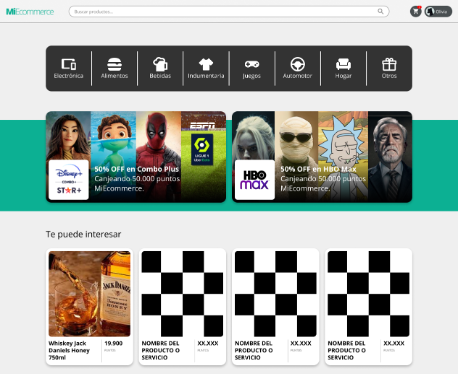

# Proyecto Ecommerce-Two

Proyecto desarrollado para la asignatura de **Programación Web** de la **Universidad Nacional de Villa Mercedes (UNVIME)**.

## Acerca del proyecto

Este es un ecommerce sencillo inspirado en Mercado Libre, desarrollado como trabajo práctico de la materia.

### Equipo de desarrollo

**Estudiantes:**

- Martín Mozainer
- Eber Chiecher
- Rocío Pereyra

### Docentes

- **Profesor Titular:** Walter Molina
- **Profesor de Práctica:** [Nombre del profesor de práctica]

## Vista del proyecto

### Landing Page



Diseños no propios, dados como recursos en la clase.

## Tecnologías utilizadas

- HTML5
- Tailswinds
- TypeScript
- Css
- Sqlite
- Express
- Ejs

## Instalación

1. Clona el repositorio

```bash
git clone https://github.com/Elses2/Ecommerce-Two
```

2. Entra en la carpeta del proyecto

```bash
cd Ecomerce-Two
```

3. Instala las dependencias necesarias

```bash
npm install
```

4. Inicia el servidor de desarrollo

```bash
npm run dev
```

5. Ver pagina

```bash
http://localhost:3000
```

6. Hacer el /dist para ponerlo en un entorno web

```bash
npm run build
```
