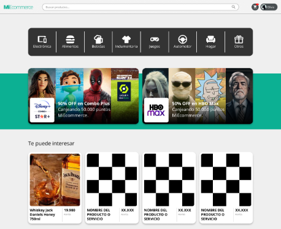

# Proyecto Ecommerce-Two

Proyecto desarrollado para la asignatura de **Programación Web** de la **Universidad Nacional de Villa Mercedes (UNVIME)**.

## Acerca del proyecto

Este es un ecommerce sencillo inspirado en Mercado Libre, desarrollado como trabajo práctico de la materia.

### Equipo de desarrollo

**Estudiantes:**

- Martín Mozainer
- Eber Chiecher
- Rocío Pereyra

### Docentes

- **Profesor Titular:** Walter Molina
- **Profesor de Práctica:** []

## Vista del proyecto

### Landing Page



Diseños no propios, dados como recursos en la clase.

## Tecnologías utilizadas

- HTML5
- Tailwind CSS
- TypeScript
- CSS
- SQLite
- Express
- EJS

## Requisitos previos

Antes de instalar el proyecto, asegurate de tener instalado en tu sistema:

- **Node.js** versión **22.0 o superior**. Podés verificar tu versión con:
  
  ```bash
  node -v
  ```
  
  Si no la tenés o tenés una versión anterior, descargala desde [nodejs.org](https://nodejs.org).

- **Python 3.x** (necesario únicamente para compilar dependencias nativas).
  Este proyecto usa `better-sqlite3`, un módulo que en algunos sistemas necesita compilarse localmente mediante `node-gyp`, y esa herramienta requiere Python instalado para funcionar. Si al correr `npm install` aparece un error relacionado con `gyp` o `node-gyp`, instalá Python desde [python.org](https://python.org) (marcando la opción **"Add python.exe to PATH"** durante la instalación) y volvé a intentar.
  
  En Windows, además de Python puede ser necesario instalar las **Build Tools de C++**:
  
  - Descargalas desde [Visual Studio Build Tools](https://visualstudio.microsoft.com/visual-cpp-build-tools/)
  - Durante la instalación, seleccioná el workload **"Desktop development with C++"**

## Instalación

1. Clona el repositorio

```bash
git clone https://github.com/Elses2/Ecommerce-Two
```

2. Entra en la carpeta del proyecto

```bash
cd Ecommerce-Two
```

3. Instala las dependencias necesarias

```bash
npm install
```

> Si esta instalación falla por errores de compilación (por ejemplo, relacionados con `better-sqlite3` o `node-gyp`), revisá la sección [Requisitos previos](#requisitos-previos).

4. Configura las variables de entorno

Este proyecto necesita un archivo `.env` en la raíz con tus propias claves (no se sube al repositorio por seguridad). Creá el archivo copiando la plantilla:

```bash
cp .env.example .env
```

Y completá los valores dentro de `.env`:

```
PORT=3000
SESSION_SECRET=pegar_key_aqui
CLOUDINARY_CLOUD_NAME=pegar_key_aqui
CLOUDINARY_API_KEY=pegar_key_aqui
CLOUDINARY_API_SECRET=pegar_key_aqui
CLOUDINARY_FOLDER=pegar_key_aqui
```

> Pedile las claves reales a algún miembro del equipo, no las inventes ni las compartas públicamente.

5. Inicia el servidor de desarrollo

```bash
npm run dev
```

6. Ver página

```
http://localhost:3000
```

7. Hacer el build para producción

```bash
npm run build
```
